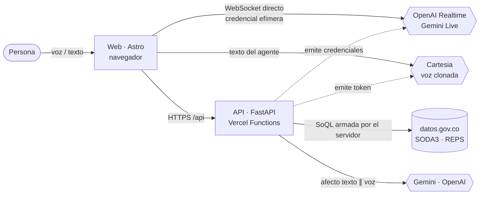

<div align="center">

# 🎙️ Kognia Voice Agent

### Agente de voz en tiempo real que consulta en vivo el registro de IPS de Colombia

Pregúntale por voz cuántos prestadores de salud hay en tu municipio, cuántas camas o ambulancias
registra un departamento o si una IPS está inscrita: responde en segundos, **solo con datos de la API
pública de datos.gov.co**, mostrando cada consulta y analizando cómo te sientes para adaptar su tono.


**Reto 01 · Hackatón Kognia Labs · 2026-10-09**

[Demo](#-demo) · [Arquitectura](#-arquitectura) · [Inicio rápido](#-inicio-rápido) · [API](#-api) · [Documentación](#-documentación)

</div>

---

## ✨ Qué hace

| | |
|---|---|
| 🗣️ **Conversación por voz natural** | Habla en español de Colombia, en tiempo real, con trato cordial y formal. Puedes interrumpirlo; el ruido ambiente no lo corta. |
| 📊 **Datos en vivo, nunca inventados** | Cada cifra sale de una consulta en vivo a la API SODA3 de datos.gov.co. El panel *API en vivo* muestra la SoQL, los ms, las filas, la fuente y el corte. |
| 🧰 **Agente con herramientas** | Cuenta, busca, valida si una IPS está registrada, perfila un municipio y compara zonas. Calcula porcentajes y diferencias en el servidor, no en el modelo. |
| 🛡️ **Mundo cerrado** | Si el dato no está en la fuente, lo dice. Un verificador revisa las cifras habladas y el agente se corrige en voz alta si algo no cuadra. |
| 💬 **Transcripción y afecto** | Transcripción con roles y marcas de tiempo; estimación de sentimiento y emoción por texto y por voz (con consentimiento) que ajusta el estilo. |
| 🔊 **Voz clonada** | Con OpenAI, la voz del agente es una voz clonada con Cartesia; si falla, pasa sola a la voz del motor. |

> **Qué no puede hacer, y lo explica:** pedir citas, confirmar disponibilidad actual, decir qué IPS
> es «la mejor» o «la más cercana». La fuente es un registro de capacidad **instalada** de 2022.

## 🔗 Demo

| | |
|---|---|
| **URL pública** | *Pendiente del despliegue en Vercel* |
| **Pantallas** | `/` portada · `/consola` conversación · `/admin` cómo respondió (herramientas, latencia, afecto) |
| **Probar** | Pulsa **«Usar mi voz»** y pregunta: *«¿Cuántas IPS públicas hay en Antioquia?»* |

## 🏗️ Arquitectura



**El audio nunca pasa por el backend.** El navegador habla directo con el motor de voz usando una
credencial de corta duración que emite la API. El backend solo emite credenciales, ejecuta las
herramientas contra datos.gov.co y analiza el afecto. No hay base de datos: el estado de la
conversación vive en el navegador.

<details>
<summary><b>Cómo fluye un turno</b></summary>

1. `POST /api/sessions` → token anónimo firmado (sin datos personales).
2. `POST /api/realtime/session` → credencial efímera con el prompt versionado, las 9 herramientas y la detección de voz.
3. La persona habla; el motor dice *«Un momento.»* y pide una herramienta.
4. El navegador llama `POST /api/tools/{nombre}`: el servidor valida, arma la SoQL y consulta en vivo.
5. La respuesta trae el **sobre de evidencia** (para la pantalla) y `for_model` (texto exacto para el motor).
6. El motor responde con la cifra; Cartesia la dice con la voz clonada.
7. En paralelo: `POST /api/analysis/utterance` (afecto y estilo) y `POST /api/verify/answer` (revisa las cifras).

</details>

## 🧱 Stack

| Capa | Tecnología | Por qué |
|---|---|---|
| Voz | **OpenAI Realtime** `gpt-realtime-2.1` (motor 1) · **Gemini Live** `gemini-3.8-live` (motor 2) | Medidos en vivo; conmutables con el selector |
| Voz clonada | **Cartesia** `sonic-3.6` | Primer audio ≈ 0,3 s con la conexión caliente |
| Backend | **FastAPI** en **Vercel Functions** (Python 3.12) | Solo HTTP; sin WebSocket propio |
| Analista | **LangGraph** · Gemini `gemini-3.5-flash-lite` (respaldo OpenAI `gpt-5.4-mini`) | Texto ∥ voz → fusión → estilo, en < 3 s |
| Datos | **datos.gov.co SODA3** con `httpx` | Consulta en vivo, caché de 60 s rotulada |
| Front | **Astro** + TypeScript, salida estática | Sin framework; avatar 3D VRM opcional |
| Despliegue | **Vercel Services** (`web` en `/`, `api` en `/api`) | Un dominio, sin CORS |

## 🚀 Inicio rápido

**Requisitos:** Python 3.12+, Node 20+ y claves de OpenAI, Gemini y (opcional) Cartesia.

```bash
# 1. Clonar e instalar
git clone https://github.com/diego-juan3112/HackatonKognia.git && cd HackatonKognia
python -m venv .venv && . .venv/bin/activate      # Windows: .\.venv\Scripts\activate
pip install -r requirements-base.txt              # runtime + pruebas
cp .env.example .env                              # y completa las claves (ver tabla)

# 2. API  →  http://127.0.0.1:8000/health
python -m uvicorn api.app_voice:app --app-dir src --host 127.0.0.1 --port 8000

# 3. Web  →  http://localhost:4321/consola
cd web && npm install
echo "PUBLIC_API_URL=http://127.0.0.1:8000" > .env
npm run dev
```

<details>
<summary><b>Variables de entorno</b> (en <code>.env</code> local o en el proyecto de Vercel; nunca en git)</summary>

| Variable | Obligatoria | Para qué |
|---|---|---|
| `OPENAI_API_KEY` | ✅ | Motor 1 y respaldo del analista |
| `GEMINI_API_KEY` | ✅ | Motor 2 y analista principal |
| `SESSION_SIGNING_KEY` | ✅ | Firma de la sesión anónima (32 bytes aleatorios) |
| `DATOS_GOV_APP_TOKEN` | Recomendada | Token de aplicación de datos.gov.co |
| `CARTESIA_API_KEY` · `CARTESIA_VOICE_ID` | Opcional | Voz clonada; sin ellas se usa la voz del motor |
| `ALLOWED_ORIGINS` | Solo si web y API están en dominios distintos | CORS |
| `VOICE_OPENAI_MODEL` · `REALTIME_*` | Opcional | Modelo y detección de voz (ver `.env.example`) |

</details>

## 🔌 API

Base: `/api` en Vercel, raíz en local. Todas las rutas salvo `/health` y `/sessions` exigen `X-Session-Token`.

| Método | Ruta | Qué hace |
|---|---|---|
| `GET` | `/health` | Estado, contrato, motores, voces, herramientas y estado de la fuente |
| `POST` | `/sessions` | Token anónimo firmado (2 h) |
| `POST` | `/realtime/session` | Credencial efímera del motor (`openai` · `gemini`) |
| `POST` | `/speech/session` | Token de síntesis de la voz clonada (600 s) |
| `GET` | `/dataset/brief` | Resumen en vivo del dataset y preguntas sugeridas |
| `POST` | `/tools/{nombre}` | Ejecuta una herramienta y devuelve el sobre de evidencia |
| `POST` | `/analysis/utterance` | Afecto (texto ∥ voz) y decisión de estilo |
| `POST` | `/verify/answer` | Verifica que las cifras habladas estén en la evidencia |
| `POST` | `/feedback` | Registra una corrección o una preferencia de tono |

<details>
<summary><b>Las 9 herramientas del agente</b></summary>

| Herramienta | Para qué |
|---|---|
| `aggregate_ips` | Contar IPS o códigos de sede, sumar capacidad; agrupar por departamento, municipio, naturaleza o nivel |
| `search_ips` | Listar sedes por ubicación, nombre, naturaleza, nivel o capacidad instalada (p. ej. urgencias) |
| `get_ips_details` | Detalle y capacidad de una sede; contacto solo si se pide |
| `verify_registration` | Validar si una IPS figura en el registro y con qué datos |
| `area_profile` | Perfil de un municipio o departamento con porcentajes calculados |
| `compare_areas` · `compare_ips` | Comparar zonas o sedes con diferencias y razones |
| `dataset_info` | Qué contiene la fuente y qué no (citas, disponibilidad…) |
| `correct_context` | Aplicar una corrección explícita («no, dije Melgar») |

</details>

## 🧪 Calidad

```bash
pytest                                   # 156 pruebas del backend, sin red ni claves
cd web && npm test                       # 134 pruebas de contrato del front
KOGNIA_LIVE=1 pytest tests/live -m live  # sondas contra datos.gov.co real
python -m scripts.smoke_public --base-url <URL>/api --origin <URL> --web-url <URL>
```

| Medición (2026-10-09) | Resultado |
|---|---|
| Alucinaciones con el motor real (20 casos trampa) | **0** · cifras exactas 5/5 · rechazos honestos 10/10 |
| Primer audio útil con consulta (p50) | **3,9 s** OpenAI · 4,2 s Gemini (antes: 9,0 s y 13,4 s) |
| 8 evaluadores simultáneos | Sin fugas entre sesiones; cada uno con sus propias respuestas |

Detalle en [`docs/anexos`](docs/anexos/): evaluación de grounding, banco de latencia y prueba de concurrencia.

## ☁️ Despliegue

Un solo proyecto con **Vercel Services** ([`vercel.json`](vercel.json)): `web` (Astro) en `/` y `api`
(FastAPI) en `/api`, región `iad1` (la misma zona AWS de datos.gov.co).

```bash
npx vercel link
npx vercel env add OPENAI_API_KEY   # y el resto de la tabla de variables
npx vercel deploy --prod
```

Plan B: [`Dockerfile`](Dockerfile) con el mismo backend. Guía completa: [docs/11](docs/11-despliegue.md).

## 📁 Estructura

```text
├── src/                 API FastAPI (Python)
│   ├── api/             app_voice.py (rutas) · voice_container.py (ensamblado)
│   ├── services/        ips/ (herramientas, SoQL, léxico) · analyst/ (LangGraph) · sesión
│   ├── integrations/    datasets/ (SODA3) · realtime/ (OpenAI, Gemini, Cartesia) · llm/
│   └── models/          contratos Pydantic y puertos
├── web/                 Front Astro (voz, consola, panel)
├── config/              prompt versionado y política de estilo
├── data/lexicon.json    léxico de nombres generado desde la API
├── scripts/             smoke, léxico, banco de latencia, evaluación
├── tests/               pruebas del backend (dobles en tests/doubles)
└── docs/                contratos, decisiones y evidencia
```

## 📚 Documentación

| Documento | Contenido |
|---|---|
| [AGENTS.md](AGENTS.md) | Reglas del proyecto (`R-xx`) para personas y asistentes de IA |
| [docs/00](docs/00-contexto-y-decisiones.md) | Contexto, stack y decisiones (`D-xx`) con sus mediciones |
| [docs/07](docs/07-reto-01-especificacion.md) | Especificación del reto y escenarios de aceptación |
| [docs/08](docs/08-contrato-voz-en-vivo.md) | Contrato de voz en vivo (eventos, interrupciones, voz clonada) |
| [docs/09](docs/09-datos-en-vivo-datos-gov-co.md) | Datos en vivo, herramientas y sobre de evidencia |
| [docs/10](docs/10-modelos-afecto-y-recuperacion.md) | Modelos, afecto, estilo y recuperación |
| [docs/11](docs/11-despliegue.md) | Despliegue y operación de la demo |

## 🤖 Uso de IA en el desarrollo

Construido con asistencia de IA, como exige el reto (RETO-M04):

- **Claude Code (Anthropic)** generó la mayor parte del backend (`src/`), los scripts, las pruebas, los
  contratos de `docs/` y buena parte del front (`web/`), a partir de los requisitos y decisiones del equipo.
- **GPT (OpenAI)** generó el paquete de planeación inicial (`docs/sdd_ips`).
- El equipo definió el alcance y las decisiones, dirigió y revisó el trabajo, y lo probó en vivo. Las
  mediciones citadas salen de llamadas reales, registradas en `docs/anexos`.

## ⚖️ Límites y datos

Capacidad **instalada** registrada en 2022, no disponibilidad · nivel de atención vacío en el 89 % de las
IPS · `departamento` incluye distritos (Cali, Barranquilla…) · el análisis de afecto es una estimación,
no un diagnóstico · el audio no se guarda.

Datos: **Ministerio de Salud y Protección Social — REPS**, vía [datos.gov.co](https://www.datos.gov.co/),
licencia [CC BY-SA 4.0](https://creativecommons.org/licenses/by-sa/4.0/).
