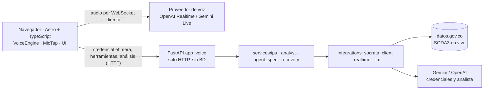
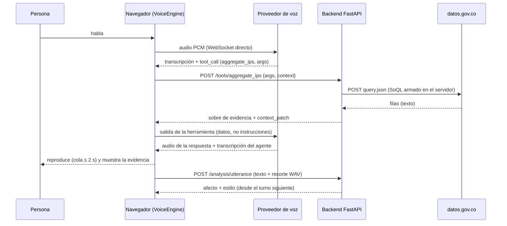

# Arquitectura del proyecto — Kognia Voice Agent

Este documento explica **qué hace cada archivo y por qué existe**. Está escrito
para que alguien que llega nuevo entienda el sistema completo sin tener que leer
todo el código.

Última actualización: 2026-09-28 (versión 0.4.0) para la base genérica; la app de
**Reto 01** (2026-10-09) se describe en la sección 11.

---

## 1. Qué es esto, en una frase

Un agente conversacional genérico sobre **LangGraph**, expuesto por **FastAPI**,
que responde con **Gemini** usando documentos embebidos con **E5** en
**PostgreSQL + pgvector**, con usuarios identificados por cédula.

**No sabemos todavía cuál será el reto** (PQR o atención financiera, por voz o
video). Por eso el núcleo modela *capacidades genéricas* y toda la parte
específica del negocio entra como configuración. Ver [00-contexto-y-decisiones.md](00-contexto-y-decisiones.md) §1.

---

## 2. El mapa mental, antes del detalle

Imagina un empleado nuevo que atiende un chat:

| Pieza del sistema | Su equivalente humano |
|---|---|
| `services/graph/` | El empleado: piensa y decide qué hacer |
| `config/domains/*.yaml` | El manual de reglas sobre su escritorio |
| PostgreSQL + pgvector | El archivero que consulta antes de responder |
| El LLM (Gemini) | Su capacidad de leer y redactar |
| `api/` | El mostrador donde el cliente le habla |
| `integrations/` | Los cables que lo conectan al mundo real |

**La regla que sostiene todo el diseño:** el empleado sigue un procedimiento
fijo escrito por nosotros. El LLM redacta y clasifica, pero **nunca decide el
camino de la conversación**. Eso es la regla R-04, y es la razón de que el grafo
esté construido a mano en vez de usar un agente ReAct prefabricado.

---

## 3. Las capas y su regla de dependencia

```
api/           ->  services/  ->  integrations/
                        \            /
                         \          /
                          models/  (transversal: todos pueden importarlo)
```

- `api/` **nunca** llama directo a `integrations/`. La única excepción
  documentada es `api/dependencies.py`, que es el *composition root*: su trabajo
  literal es ensamblar el objeto grafo.
- `services/` **nunca** importa psycopg, Gemini, sentence-transformers ni FastAPI. Solo
  conoce los `Protocol` de `models/ports.py`.
- `models/` no tiene comportamiento: estructuras de datos y contratos.

Esto se puede verificar mecánicamente:

```bash
grep -rn "^from integrations\|^import integrations" src/services/ src/models/
# no debe devolver nada
```

### Reglas de arquitectura

| Código | Regla |
|---|---|
| R-01 | Cada capa llama solo a la inmediatamente inferior: `api/` → `services/` → `integrations/`. Nunca al revés ni saltando una capa. `models/` es transversal porque no tiene comportamiento. |
| R-02 | **Núcleo genérico (no negociable).** `services/` modela capacidades genéricas, nunca lógica de un dominio. La lógica del reto entra como configuración (catálogo de intenciones y esquema de campos en YAML) o como nodos **adicionales**; los nodos existentes no se editan. Si adaptar el agente exige modificar un nodo genérico, el nodo estaba mal diseñado: se corrige el nodo, no se contamina con el dominio. |
| R-04 | El LLM nunca decide transiciones de estado. El grafo controla el flujo; el LLM genera contenido o interpreta intención dentro de un nodo (por eso D-07). |
| R-05 | Ninguna credencial, API key o secreto hardcodeado: siempre variables de entorno, leídas **solo en `src/config.py`** (§4.5). Ningún otro módulo usa `os.environ` ni carga `.env`. `config.py` es transversal como `models/`, pero los campos de credenciales solo los usa `integrations/`. |

Capacidades que el núcleo sí modela (R-02):

| Capacidad | Qué hace | Qué NO hace |
|---|---|---|
| Intake | Recibe y normaliza el turno del usuario | Asumir que es una queja o un trámite bancario |
| Clasificación de intención | Mapea el turno a una intención de un catálogo **configurable** | Tener el catálogo hardcodeado |
| Recolección de datos | Pide los campos que falten según un **esquema declarado** | Saber que necesita "número de póliza" |
| Enrutamiento / escalamiento | Decide continuar, derivar o escalar a humano | Conocer los equipos de una empresa concreta |
| Respuesta | Genera la respuesta con el contexto recuperado | Contener plantillas de un dominio |

**Prueba de fuego:** el núcleo debe poder pasar de "agente de PQR" a "agente de
atención financiera" cambiando configuración y nodos periféricos, sin tocar
`services/graph/nodes/` genéricos.

---

## 4. Archivo por archivo

### 4.1 Raíz del repositorio

| Archivo | Rol |
|---|---|
| `AGENTS.md` | **Índice de reglas** (`R-xx`) y qué documento leer antes de cada tarea. Se lee antes de escribir código. |
| `CLAUDE.md` | Específico de Claude Code: MCP, plugins, skills. No reemplaza AGENTS.md. |
| `README.md` | Arranque rápido y comandos. |
| `CHANGELOG.md` | Historial de cambios por versión (R-20). |
| `docs/00-…06-*.md` | Los contratos del proyecto: contexto y decisiones, esta arquitectura, puertos, API, RAG, pruebas y flujo de trabajo. |
| `docker-compose.yml` | Levanta PostgreSQL 17 + pgvector en el puerto **5433**. Puerto distinto al 5432 a propósito, para no tocar un Postgres nativo que ya exista. |
| `pyproject.toml` | Configuración de pytest (incluido `pythonpath = ["src"]`, sin el cual nada importa), ruff y mypy. |
| `requirements.txt` | Dependencias, agrupadas y comentadas con el porqué de cada grupo. |
| `.env.example` | Plantilla de variables. Se copia a `.env`, que está en `.gitignore`. |
| `Dockerfile` | Imagen de la aplicación para Azure Container Apps. **Desactualizado:** no copia `config/` ni `migrations/`, así que el contenedor no arrancaría, y descargaría E5 (~1 GB) en cada arranque. Se reescribe en la fase de despliegue. |

### 4.2 `migrations/` — el esquema de la base

| Archivo | Rol |
|---|---|
| `001_init.sql` | Crea la extensión `vector` y las 6 tablas. **No se edita después de aplicado**; los cambios van en `002_...sql`. |

Se escribió SQL plano en vez de SQLAlchemy + Alembic a propósito: el esquema son
seis tablas y la prioridad es que cualquiera pueda leer el archivo y saber
exactamente cómo es la base, sin un ORM de por medio.

**Las tablas del checkpointer de LangGraph no están aquí** — las crea la propia
librería al arrancar, con `.setup()`.

### 4.3 `scripts/` — comandos operativos

| Archivo | Rol |
|---|---|
| `migrate.py` | Aplica las migraciones pendientes. `--status` muestra qué falta; `--test` apunta a la base de pruebas. Es un CLI delgado: la lógica vive en `src/integrations/db/migrations.py`. |
| `seed.py` | Siembra la base de **desarrollo**: 2 usuarios demo (`1000000001` Ana Demo, `1000000002` Beto Demo) y el corpus de `docs/faq_demo` embebido con E5. Idempotente. |
| `ingest.py` | Indexa documentos en la base de conocimiento. Es el comando que se corre el día del evento apuntando a lo que nos entreguen. Soporta `.md`, `.txt`, `.csv`, `.pdf`. |
| `serve.py` | **Arranca el servidor. Úsalo en vez de invocar `uvicorn` directamente** — ver §4.4. |

### 4.4 `src/platform_compat.py` — el problema de Windows

Este archivo existe por un solo motivo, pero no es opcional.

**psycopg3 se niega a correr sobre el `ProactorEventLoop`**, que es el event
loop por defecto de Windows desde Python 3.8:

```
psycopg.InterfaceError: Psycopg cannot use the 'ProactorEventLoop'
to run in async mode.
```

El síntoma es engañoso: el pool de conexiones simplemente **nunca termina de
abrir** y expira por timeout, mientras que una conexión síncrona a la misma
base funciona perfecto. Por eso `scripts/migrate.py` (síncrono) funcionaba y
todo lo async fallaba.

Y hay una segunda capa: **uvicorn 0.36+ construye su loop con un
`loop_factory`, que ignora la política del event loop.**

```python
# uvicorn/server.py
return asyncio_run(self.serve(sockets=sockets),
                   loop_factory=self.config.get_loop_factory())
```

Es decir, llamar a `asyncio.set_event_loop_policy(...)` antes de `uvicorn.run()`
**no sirve de nada**. La vía soportada es pasar la factory por la opción `loop`
de uvicorn, que acepta un import string — y eso es lo que hace `scripts/serve.py`:

```python
uvicorn.run(..., loop="platform_compat:new_selector_event_loop")
```

El módulo expone tres cosas:

| Función | Para qué |
|---|---|
| `ensure_psycopg_compatible_event_loop()` | Cambia la política. La llaman `tests/conftest.py` y `scripts/ingest.py`, que sí crean su loop vía `asyncio.run`. |
| `new_selector_event_loop()` | La factory que consume uvicorn. Funciona también para los subprocesos de `--reload`. |
| `assert_event_loop_is_usable()` | Se llama al arrancar la app. Si alguien corre `uvicorn api.main:app` a mano, falla de inmediato con un mensaje que explica qué hacer, en vez de colgarse en un timeout opaco. |

En Linux y macOS las tres son no-ops: el loop por defecto ya es compatible.

### 4.5 `src/config.py` — configuración centralizada

Único lugar donde se leen variables de entorno. Usa `pydantic-settings`, que
llena cada campo desde el entorno o desde `.env`, y valida los valores (un
`RETRIEVAL_TOP_K=cuatro` falla al arrancar, no en mitad de la demo).

No contiene contraseñas: los valores por defecto de `database_url` y
`test_database_url` no llevan credenciales, que llegan solo desde `.env`.
El modelo de Gemini por defecto lleva al lado, en un comentario, las
mediciones con las que se eligió.

Expone también `EMBEDDING_DIMENSIONS = 768`, que es la constante que debe
coincidir con la columna `document_chunks.embedding vector(768)`.

`database_url_safe` devuelve la URL con la contraseña enmascarada, para poder
mostrarla en `/health` y en errores sin filtrar credenciales.

### 4.6 `src/models/` — datos y contratos (capa transversal)

| Archivo | Rol |
|---|---|
| `ports.py` | **El archivo más importante del diseño.** Define los `Protocol` que `services/` usa para hablar con el mundo: `LLMPort`, `RetrievalPort`, `UserRepositoryPort`, `ConversationRepositoryPort`, y los aún no implementados `VoicePort` y `AvatarPort`. Ningún nombre de proveedor aparece aquí. |
| `auth.py` | `User`, `Session`, `Identification`, `Conversation`, `MessageRecord`. |
| `conversation.py` | `Utterance`, `AudioChunk`, `SpeechChunk`, `VisemeFrame`, `RouteDecision`, `TurnResult`. Los tipos de audio existen aunque no haya proveedor de voz: son el contrato que ese proveedor tendrá que cumplir. |
| `retrieval.py` | `Document`, `Chunk`, `RetrievedChunk`, `IngestionReport`. |
| `domain_config.py` | `DomainSpec`, `IntentSpec`, `FieldSpec`. La descripción declarativa de un dominio de negocio. |

Los puertos viven aquí y no en `services/` por una razón concreta: si vivieran
en `services/`, entonces `integrations/` tendría que importar hacia arriba y se
rompería la regla de dependencia.

### 4.7 `src/services/` — la lógica de negocio

#### `graph/` — el agente

| Archivo | Rol |
|---|---|
| `state.py` | `ConversationState`: lo que viaja entre nodos (mensajes, intención, datos recolectados, campos faltantes, ruta, contexto recuperado, número de turno, y `user`: quién habla). Ningún campo lleva nombre de un dominio de negocio. `UserContext` lleva la cédula **ya enmascarada** (últimos 4 dígitos): el estado se persiste y nadie en el grafo necesita el número completo. |
| `builder.py` | Ensambla y compila el grafo. Recibe LLM, retriever, dominio y checkpointer **por inyección** — por eso los mismos nodos corren contra Postgres en producción y contra memoria en los tests. |
| `edges.py` | Las transiciones. `after_route` es una **función pura** que lee `state["route"]` y nada más. Aquí no hay LLM, no hay I/O, no hay reloj. |
| `nodes/intake.py` | Recibe el turno: cuenta el turno y limpia el estado del turno anterior. |
| `nodes/classify_intent.py` | Mapea el mensaje a una intención del catálogo del YAML. Usa el LLM, pero **valida la respuesta contra el catálogo** — nunca propaga una intención inventada. |
| `nodes/collect_data.py` | Mira qué campos declarados faltan e intenta extraerlos de la conversación. |
| `nodes/route.py` | **Decide el camino, sin LLM.** Reglas en orden: intención marcada como escalamiento → faltan datos → límite de turnos → responder. |
| `nodes/retrieve_context.py` | Pide contexto al `RetrievalPort`. No sabe que detrás hay pgvector. |
| `nodes/respond.py` | Redacta. Dos de las tres ramas (pedir dato, escalar) son deterministas y no gastan una llamada al modelo. En la tercera arma **un solo** mensaje de sistema (prompt del dominio + quién habla + contexto recuperado) y envía los últimos turnos de **ambos** lados de la conversación. |

#### Servicios de aplicación

| Archivo | Rol |
|---|---|
| `domain_loader.py` | Carga un `DomainSpec` desde YAML. Único lugar que lee ese archivo. |
| `auth_service.py` | `register` crea un usuario (falla si la cédula ya existe); `login` abre sesión **solo** para usuarios registrados. Normaliza el formato (`1.053.812.345` y `1053812345` son la misma persona) y valida vencimiento de sesiones. |
| `chat_service.py` | Orquesta un turno completo: resolver conversación → correr el grafo → persistir ambos mensajes. Es quien le dice al grafo **quién habla** (nunca el LLM). Vive aquí y no en el router porque decidir qué significa un turno es lógica de negocio. También impone que **nadie lea ni escriba en la conversación de otro**. |

### 4.8 `src/integrations/` — el mundo exterior

| Archivo | Rol |
|---|---|
| `db/pool.py` | Pool async de conexiones, uno por proceso. Registra el tipo `vector` de pgvector para que psycopg convierta listas de Python automáticamente. Se construye sin conectar (`open=False`) para que importar no toque la red. |
| `db/user_repository.py` | Todo el SQL de identidad. Traduce la violación de unicidad de la cédula a `UserAlreadyExists`, para que nada por encima sepa que existe psycopg. |
| `db/migrations.py` | Descubrir, aplicar y listar migraciones pendientes, y crear la base si no existe. Lo usan el CLI, los tests de integración y la verificación de arranque. |
| `db/conversation_repository.py` | Todo el SQL de conversaciones e historial. Guarda el mensaje y mueve `updated_at` **en la misma transacción**. |
| `retrieval/pgvector_retriever.py` | Implementa `RetrievalPort` sobre pgvector. Usa el operador `<=>` (distancia coseno), que es para el que está construido el índice HNSW. Una transacción por documento: reingestar reemplaza atómicamente. |
| `retrieval/embeddings.py` | `E5Embedder` (`multilingual-e5-base`, local, sin API key). Carga **primero desde la caché** y solo descarga si falta: sin eso consultaba a Hugging Face en cada arranque. La interfaz es **asimétrica** (`embed_documents` / `embed_query`) porque E5 exige prefijos `passage:` y `query:`. |
| `retrieval/loaders.py` | Un cargador por formato. Agregar un formato nuevo es una función y una entrada en un diccionario. |
| `llm/factory.py` | Único archivo que sabe que el LLM es Gemini. Envía solo el control de *thinking* que aplica al modelo, con timeout y reintentos acotados. |
| `voice/README.md` | **Vacío a propósito.** R-08 prohíbe implementar un proveedor de voz mientras no se decida cuál. |
| `avatar/README.md` | **Vacío a propósito**, por la misma razón. |

### 4.9 `src/api/` — la capa HTTP

| Archivo | Rol |
|---|---|
| `main.py` | La app y su `lifespan`. **Nada se construye al importar**. También traduce los errores del modelo a códigos honestos: cuota agotada → 503 con `Retry-After`, otro fallo → 502. Captura las excepciones genéricas de `langchain-core`, no las de Google, así que no sabe qué proveedor hay detrás. |
| `errors.py` | Declara los errores de cada ruta (`{"detail": ...}`) para que Swagger los muestre. Sin esto, un 404 aparece en `/docs` como *Undocumented*. |
| `dependencies.py` | El *composition root*. **Se niega a arrancar si hay migraciones pendientes**, abre el pool, prepara el checkpointer, arma el grafo y los servicios. También define `current_user`, que valida el header `X-Session-Id`. |
| `routers/users.py` | `POST /users` → 201, o 409 si la cédula ya existe |
| `routers/auth.py` | `POST /auth/login` → 200 con sesión, o 404 si la cédula no está registrada |
| `routers/chat.py` | `POST /chat` |
| `routers/conversations.py` | `GET/POST /conversations`, `GET /conversations/{id}/messages` |

### 4.10 `tests/`

| Ruta | Rol |
|---|---|
| `conftest.py` | Fixtures compartidas. **Ninguna** requiere credencial, red ni base de datos. |
| `doubles/` | **El único lugar donde existe lógica falsa.** `FakeChatModel` (responde según la forma del prompt), `HashingEmbedder` (vectores léxicos), retriever y repositorios en memoria. Respetan las mismas invariantes que la base (cédula única, cascada, `updated_at`), así que un test que pasa aquí es evidencia real. |
| `services/` | Enrutamiento, grafo completo, registro/login, chat, y la identidad en el prompt: incluido un test que garantiza que **la cédula completa nunca llega al LLM**. |
| `integrations/` | Cargadores, embeddings y ranking. |
| `api/` | Contrato HTTP, códigos de estado, y que nadie lea la conversación de otro. |
| `integration/` | **Requieren PostgreSQL vivo** y corren en `kognia_test`, nunca en la base de desarrollo: se niegan a vaciar cualquier base cuyo nombre no termine en `_test`. Se saltan solos si no hay base. Se corren con `pytest -m integration`. |

---

## 5. El flujo de una petición, paso a paso

```
POST /users {"cedula": "1.053.812.345", "display_name": "Ana"}
  │
  ├─ auth_service.register
  │    ├─ normalize_cedula          -> "1053812345"
  │    ├─ users.find_by_cedula      -> ya existe? -> 409
  │    └─ users.create              -> INSERT INTO users
  └─ 201 {id, cedula, display_name}

POST /auth/login {"cedula": "1053812345"}
  │
  ├─ auth_service.login
  │    ├─ users.find_by_cedula      -> no existe? -> 404 (nunca la crea)
  │    ├─ users.touch_last_seen
  │    └─ users.create_session      -> INSERT INTO sessions
  └─ 200 {user_id, session_id, display_name, expires_at}

POST /chat  header X-Session-Id: <uuid>
  │
  ├─ current_user           valida sesión, vencimiento, revocación
  ├─ chat_service.send(user, ...)
  │   ├─ _resolve           obtiene o crea la conversación (y verifica que sea del usuario)
  │   ├─ append_message     INSERT mensaje del usuario
  │   ├─ graph.ainvoke      estado inicial con user = {nombre, cédula ****2345}
  │   │   │                 config {thread_id}
  │   │   ├─ intake              turn_count += 1
  │   │   ├─ classify_intent     Gemini -> intención (validada contra el catálogo)
  │   │   ├─ collect_data        ¿faltan campos declarados? Gemini los extrae como JSON
  │   │   ├─ route               DECISIÓN DETERMINISTA, sin LLM
  │   │   │    ├─ ANSWER   -> retrieve_context (E5 + pgvector) -> respond (Gemini)
  │   │   │    ├─ COLLECT  -> respond (pregunta por el dato, sin LLM)
  │   │   │    └─ ESCALATE -> respond (mensaje del YAML, sin LLM)
  │   │   └─ el checkpointer persiste el estado en PostgreSQL
  │   └─ append_message     INSERT respuesta + intent + route + sources
  └─ 200 TurnResult
```

Medido con Gemini y E5 reales: **1-3.5 s por turno**.

---

## 6. Por qué la conversación se guarda en dos sitios

No es duplicación por descuido. Son dos preguntas distintas:

| | Checkpointer de LangGraph | Tabla `messages` |
|---|---|---|
| **Qué guarda** | Estado interno del grafo, serializado | Historial legible |
| **Para qué sirve** | Reanudar exactamente donde iba | Mostrar, auditar, hacer `JOIN` |
| **Quién crea las tablas** | LangGraph, con `.setup()` | Nuestra migración `001_init.sql` |
| **Consultable en SQL** | No, en la práctica | Sí |

---

## 7. Los puertos y su estado

| Puerto | Proveedor | Estado |
|---|---|---|
| `LLMPort` | Gemini (`gemini-3.5-flash-lite`) | Implementado |
| `RetrievalPort` | PostgreSQL + pgvector, embeddings E5 | Implementado |
| `UserRepositoryPort` | PostgreSQL | Implementado |
| `ConversationRepositoryPort` | PostgreSQL | Implementado |
| `VoicePort` | **Sin decidir** — ver [00](00-contexto-y-decisiones.md) §3 | Declarado, sin implementar |
| `AvatarPort` | **Sin decidir** — ver [00](00-contexto-y-decisiones.md) §4 | Declarado, sin implementar |

Los puertos ya se probaron dos veces: se reemplazó Chroma por pgvector y NVIDIA
por Gemini, y **ningún nodo del grafo cambió de responsabilidad** en ninguno de
los dos casos. Los ajustes que sí hubo en los nodos (leer `.text`, tolerar JSON
envuelto en bloques de código) fueron de robustez, no de proveedor.

---

## 8. Advertencias importantes

### La autenticación no es autenticación

La identificación por cédula **no verifica nada**. Cualquiera que conozca una
cédula registrada obtiene una sesión válida para esa persona. Fue una decisión
consciente de alcance para la demo. **No expongas datos sensibles detrás de
esto** sin agregar antes una verificación de credencial real.

### Qué le llega al LLM sobre la persona

Solo el **nombre** y los **últimos 4 dígitos** de la cédula. El tier gratuito de
Gemini puede usar los prompts para mejorar sus productos, y la cédula completa
es un dato personal (Ley 1581). `tests/services/test_user_context.py` revisa
todos los prompts —clasificación, extracción y respuesta— y falla si la cédula
completa aparece en cualquiera.

### Al elegir modelo, el catálogo no prueba nada

Nos pasó con dos proveedores. En NVIDIA, modelos listados como disponibles
respondían `410 Gone`. En Gemini, los `gemini-2.5-*` aparecen en la lista de
modelos y responden 404: *"no longer available to new users"*. **Hay que llamar
al modelo antes de elegirlo**, y verificar por conteo de tokens de
razonamiento que el control de *thinking* realmente llega a la API.

### Cuota gratuita de Gemini

Tiene límite de peticiones por minuto, y un turno con RAG cuesta dos llamadas.
Si se agota, la API responde **503 con `Retry-After`**, no un 500. Varios
jurados probando a la vez podrían toparlo.

### La dimensión del embedding está clavada en el esquema

`document_chunks.embedding` es `vector(768)`, que corresponde a
`multilingual-e5-base`. Cambiar de modelo a uno de otra dimensión exige una
migración nueva y reindexar todo. `E5Embedder` lo valida al arrancar.

### Los dobles de prueba no son el producto

`FakeChatModel` y `HashingEmbedder` viven solo en `tests/doubles/`. Existen para
que `pytest` corra en segundos sin red ni cuota. Que la suite pase prueba que el
cableado es correcto, no la calidad de las respuestas: para eso está el
recorrido HTTP con modelos reales.

---

## 9. Comandos

```bash
# Dependencias
pip install -r requirements-base.txt   # desarrollo: base genérica + pruebas (incluye requirements.txt)
pip install -r requirements.txt        # solo el runtime de Reto 01 (lo que va a Vercel / contenedor)

# App de voz de Reto 01 (sin base de datos; docs/11)
python -m uvicorn api.app_voice:app --app-dir src --port 8000

# Base de datos
docker compose up -d
python -m scripts.migrate            # base de desarrollo
python -m scripts.migrate --test     # base de pruebas (los tests también la migran solos)
python -m scripts.seed               # usuarios demo + corpus embebido con E5

# Reindexar lo que nos entreguen el día del reto
python -m scripts.ingest --path <carpeta> --reset

# Pruebas
pytest                  # con dobles: sin red, sin Docker, sin key
pytest -m integration   # contra PostgreSQL real, en kognia_test

# Servidor  (NO uses uvicorn directamente en Windows, ver 4.4)
python -m scripts.serve
python -m scripts.serve --reload --port 8080
```

---

## 10. Qué hay que hacer el día del reto

1. **Dominio:** escribir `config/domains/<reto>.yaml` con el catálogo de
   intenciones y el esquema de campos. Apuntar `DOMAIN_CONFIG_PATH` ahí.
2. **Conocimiento:** `python -m scripts.ingest --path <carpeta> --reset`.
3. **Usuarios:** `POST /users` por cada persona de la demo, o ampliar
   `scripts/seed.py`.
4. **Voz/avatar:** implementar el adaptador en `integrations/voice/` o
   `integrations/avatar/` — y **solo** ahí.

Borrar `config/domains/faq_demo.yaml` y `docs/faq_demo/` cuando el dominio real
esté listo: son desechables por diseño (R-07).

---

## 11. Reto 01: la app de voz (sin base de datos)

Todo lo anterior describe la **base genérica** (chat con cédula, RAG y PostgreSQL), que
sigue intacta. **Reto 01** (2026-10-09) se construye como una **app aparte**, con raíz de
composición propia (`api/app_voice.py`), que reutiliza `models/`, `config.py`, el patrón de
puertos, LangGraph (el analista de afecto) y los dobles de prueba, y que **no carga**
`retrieval/`, `db/`, `auth_service` ni `chat_service`. Qué se acepta:
[07](07-reto-01-especificacion.md); decisiones: D-09 a D-19.



Un turno, de punta a punta:



| Módulo *(planeado)* | Rol | Carril |
|---|---|---|
| `src/api/app_voice.py`, `routers/` | FastAPI: `/health`, `/sessions`, `/realtime/session`, `/tools/{n}`, `/dataset/brief`, `/analysis/utterance`, `/feedback` | B |
| `src/api/dependencies_voice.py` | Raíz de composición sin base de datos | B |
| `src/models/ips.py`, `context.py`, `affect.py`, `realtime.py` | Esquemas: herramientas y sobre de evidencia, estado canónico, afecto y estilo, sesión | B |
| `src/services/ips/` | Herramientas, resolución de entidades con léxico, brief | B |
| `src/services/analyst/` | Grafo del analista y política de estilo | B |
| `src/services/agent_spec.py` | Instrucciones v1, declaración de herramientas, sobre de contexto | B |
| `src/services/recovery.py` | Plazos, intentos y mapeo de fallo a respuesta | B |
| `src/integrations/datasets/socrata_client.py` | SODA3 con respaldo SODA2 (`httpx`) | B |
| `src/integrations/realtime/{openai,gemini}.py` | Credenciales efímeras y configuración por motor | B |
| `src/integrations/llm/registry.py` | Perfiles `fast`/`deep` y cadena de respaldo | B |
| `config/domains/reto01_ips.yaml`, `config/style_policy.yaml`, `config/models.yaml` | Domain pack, política de estilo, perfiles | B |
| `data/lexicon.json`, `scripts/build_lexicon.py` | Léxico estático y su generador | B |
| `web/` (Astro) | `src/voice/` (`VoiceEngine`, adaptadores, `MicTap`, reproductor, estado canónico), `src/ui/` (transcripción, API en vivo, afecto, HUD, controles), `mocks/` | A |

**Capas.** R-01 sigue vigente: `api/app_voice.py` es la raíz de composición (puede importar
adaptadores concretos); `services/` no importa SDKs de proveedores ni FastAPI. El cliente
tiene su propia frontera: solo los adaptadores de `web/src/voice/` conocen el protocolo
de OpenAI o de Gemini (R-03). Los nodos genéricos de `services/graph/nodes/` **no se usan** en
la ruta de voz y no se editan (R-02).
