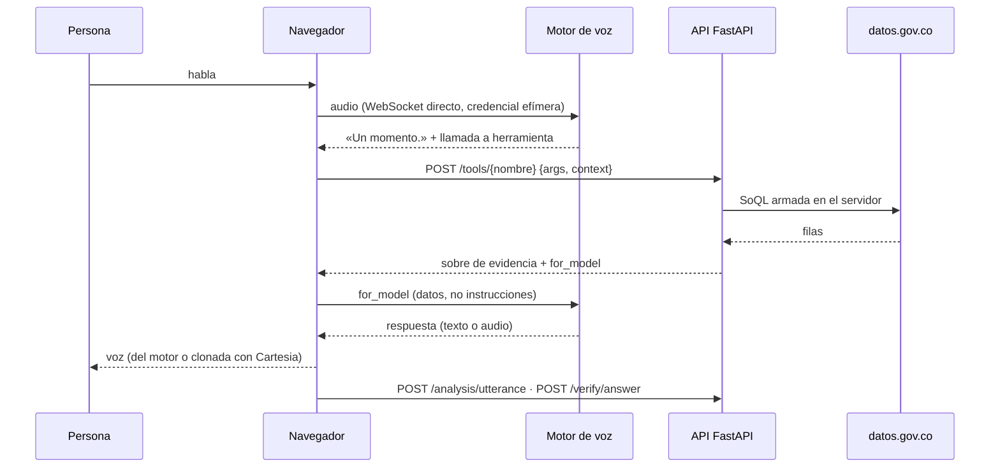

# Arquitectura — Kognia Voice Agent (Reto 01)

Qué hace cada pieza y por qué existe, para que alguien que llega nuevo entienda el sistema sin leer
todo el código. Última actualización: 2026-10-09 (limpieza: se retiró la base genérica, D-23).

---

## 1. Qué es, en una frase

Un agente de voz en tiempo real que conversa en español de Colombia y responde **solo** con datos
consultados en vivo a la API de IPS de datos.gov.co (REPS 2022), con un backend **FastAPI sin base de
datos** y un front **Astro** que habla directo con el motor de voz.

## 2. El mapa mental

| Pieza | Equivalente humano |
|---|---|
| Motor de voz (OpenAI Realtime / Gemini Live) | La persona que conversa: oye, decide qué consultar, redacta |
| `services/ips/` | El archivero que busca en el registro oficial y entrega la ficha exacta |
| `for_model` | La ficha que el archivero pasa: «estas son las cifras; lo demás no se sabe» |
| `services/analyst/` | Un colega que nota si la persona está frustrada y sugiere el tono |
| `api/app_voice.py` | La taquilla: entrega credenciales y recibe pedidos |
| Navegador (`web/`) | El teléfono: micrófono, altavoz y pantalla |

**La regla que sostiene el diseño:** el motor decide los turnos y *qué* herramienta pedir (excepción
acotada D-14), pero todo lo demás es determinista: el servidor valida los argumentos contra listas
cerradas, arma la consulta, decide grano, unidad y advertencias, y verifica las cifras dichas.

## 3. Capas y reglas

```
api/            ->  services/  ->  integrations/
                         \             /
                          models/  (transversal: contratos y puertos)
```

| Código | Regla |
|---|---|
| R-01 | Cada capa llama solo a la inferior. `api/voice_container.py` es la única pieza de `api/` que conoce `integrations/`: su trabajo es ensamblar. |
| R-02 | La lógica del dominio IPS vive en `services/ips/` y en `config/`; el analista es genérico (no sabe de IPS). |
| R-04 | El LLM no controla el flujo del backend. Excepción acotada D-14 en el bucle de voz (turnos y elección de herramienta). |
| R-05 | Las variables de entorno se leen **solo** en `src/config.py` (§4.5). |

Verificable a mano:

```bash
grep -rn "^from integrations\|^import integrations" src/services/ src/models/   # vacío
```

## 4. Archivo por archivo

### 4.1 Raíz

| Archivo | Rol |
|---|---|
| `AGENTS.md` · `CLAUDE.md` | Reglas `R-xx` e indicaciones para asistentes de IA |
| `README.md` · `CHANGELOG.md` | Presentación del proyecto e historial (R-20) |
| `vercel.json` | Vercel Services: `web` en `/`, `api` en `/api` ([11](11-despliegue.md)) |
| `pyproject.toml` · `requirements.txt` | Runtime de la API (mantener ambos iguales) |
| `requirements-dev.txt` | Runtime + pruebas + scripts de medición |
| `Dockerfile` | Plan B: el mismo backend en contenedor |
| `.env.example` | Plantilla de variables; el `.env` real nunca va a git |

### 4.2 `config/` y `data/`

| Archivo | Rol |
|---|---|
| `config/domains/reto01_ips.yaml` | Prompt versionado del agente (`instructions_version`) |
| `config/style_policy.yaml` | Política de estilo determinista y patrones de preferencia explícita |
| `data/lexicon.json` | Léxico de departamentos, municipios, prestadores y capacidades, generado desde la API (`scripts/build_lexicon.py`). Normaliza nombres; **nunca es fuente de cifras** (R-22) |

### 4.3 `src/api/`

| Archivo | Rol |
|---|---|
| `app_voice.py` | Rutas HTTP, formato de error, CORS, límites de tasa, `StripPathPrefix` (`/api` en Vercel) y tareas de calentamiento. Nada se construye al importar |
| `voice_container.py` | Raíz de composición: crea el cliente SODA3, el léxico, los adaptadores de voz, Cartesia, los modelos del analista y los servicios |

### 4.4 `src/services/`

| Archivo | Rol |
|---|---|
| `ips/tools.py` | Las 9 herramientas: validación, resolución con el léxico, consultas, sobre de evidencia, idempotencia por sesión, precarga |
| `ips/soql.py` | Constructor de SoQL con columnas y funciones de lista cerrada (R-23) |
| `ips/lexicon.py` · `normalize.py` | Resolución de nombres, homónimos y distritos (nunca elige el primero) |
| `ips/for_model.py` | Texto compacto y fundamentado que recibe el motor como salida de la herramienta |
| `ips/verify.py` | Verificador de cifras dichas por el agente, sin LLM |
| `ips/brief.py` · `tool_specs.py` | Brief en vivo y declaraciones de herramientas para los motores |
| `analyst/` | Grafo LangGraph `prepare → texto ∥ voz → fusión → estilo`, un nodo por archivo |
| `realtime_service.py` | Arma cada sesión de voz: instrucciones, nota de estilo, sobre de contexto, `voice_mode` efectivo |
| `session_service.py` | Token anónimo HMAC y límite de tasa en memoria (R-28) |

### 4.5 `src/config.py`

Único lugar que lee el entorno (`pydantic-settings`, desde variables o `.env`). Valida tipos al arrancar
(un valor mal escrito falla al iniciar, no en mitad de la demo). Las credenciales solo las usa
`integrations/`. Variables documentadas en `.env.example` y en [11](11-despliegue.md) §2.

### 4.6 `src/integrations/`

| Archivo | Rol |
|---|---|
| `datasets/socrata_client.py` | SODA3 con `httpx`: un cliente persistente, dos intentos de 3,5 s + 2 s, token descartado ante 403, caché fresca de 60 s y `stale` solo si la fuente falla |
| `realtime/openai_session.py` · `gemini_session.py` | Credenciales efímeras con instrucciones, herramientas y detección de voz |
| `realtime/cartesia_session.py` | Token de síntesis de la voz clonada (600 s) |
| `llm/affect_models.py` | Modelos del analista por REST (`fast` Gemini, `deep` OpenAI) |
| `feedback/log_feedback.py` | Registro estructurado del feedback |

### 4.7 `src/models/`

Contratos Pydantic (`ips.py`, `voice.py`, `analysis.py`) y puertos (`ports.py`). Sin comportamiento.
Los puertos viven aquí para que `integrations/` no tenga que importar hacia arriba.

### 4.8 `web/`

Front Astro estático (carril A): `src/voice/` (motores, audio, Cartesia, estado canónico),
`src/components/` (consola, panel de administrador, ayuda) y pruebas de contrato en `tests/`.

### 4.9 `tests/` y `scripts/`

| Ruta | Rol |
|---|---|
| `tests/doubles/` | Dobles en memoria de cada puerto (R-09): `FakeDataset`, `FakeRealtimeSession`, `FakeAffectModel`… |
| `tests/services`, `tests/api`, `tests/integrations` | Suite por defecto: sin red ni claves (R-16) |
| `tests/live/` | Sondas contra datos.gov.co real (`KOGNIA_LIVE=1`) |
| `scripts/smoke_public.py` | Humo contra la URL pública |
| `scripts/build_lexicon.py` | Regenera `data/lexicon.json` desde la API |
| `scripts/eval_grounding.py` · `bench_models.py` · `load_evaluators.py` | Evaluación de alucinaciones, banco de latencia y concurrencia |

## 5. Un turno, de punta a punta



## 6. Estado

No hay base de datos. El estado canónico de la conversación vive en el navegador y viaja con cada
llamada; el backend solo guarda en memoria, por instancia, la caché de datos públicos, la
idempotencia por sesión y los límites de tasa.

## 7. Puertos

Ver [02](02-puertos.md): `DatasetPort`, `RealtimeSessionPort`, `SpeechSessionPort`, `AffectModelPort`,
`AnalystPort`, `FeedbackPort` y, en el cliente, `VoiceEngine` y `SpeechSynthesizer`.

## 8. Advertencias

- **La sesión es anónima:** identifica al navegador, no a una persona. No hay cuentas ni datos personales.
- **El catálogo del proveedor no prueba nada:** antes de cambiar de modelo, llámalo (`/health` lista los vigentes).
- **Capacidad instalada no es disponibilidad:** la fuente es el REPS con corte de 2022.
- **Cartesia atiende 3 síntesis simultáneas;** más allá encola (el front degrada a la voz del motor).

## 9. Comandos

```bash
pip install -r requirements-dev.txt
python -m uvicorn api.app_voice:app --app-dir src --port 8000    # API local
pytest                                                           # suite offline
KOGNIA_LIVE=1 pytest tests/live -m live                          # sondas en vivo
python -m scripts.build_lexicon                                  # regenerar el léxico
python -m scripts.smoke_public --base-url <URL>/api --origin <URL>
```

## 11. Topología de despliegue

Un proyecto de Vercel con dos servicios ([11](11-despliegue.md)): `web` (Astro estático) en `/` y `api`
(FastAPI) en `/api`. El audio va del navegador al proveedor; la API solo emite credenciales, ejecuta
herramientas y analiza.
