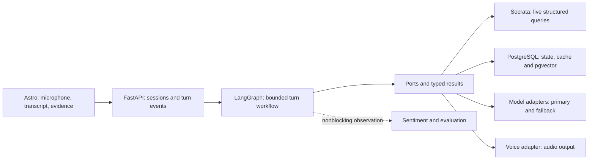
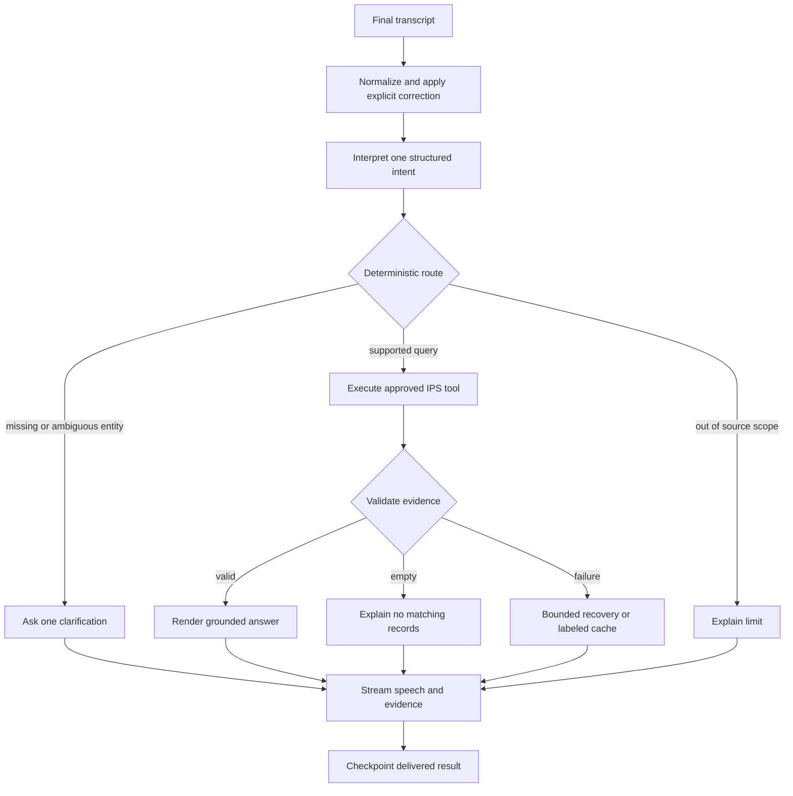

# 01 — Clean architecture and graph design

## Dependency direction

Keep the existing folders. FastAPI translates requests; services own use cases;
models define vendor-neutral data and ports; integrations implement the ports.
`src/api/dependencies.py` is the composition root and may import concrete
adapters. Services receive dependencies through constructors/factories and do
not import provider SDKs, SQL drivers or FastAPI.

This is one deployable backend, not a collection of independently deployed
agents. Multiple logical roles share contracts and immutable evidence. The
graph owns routing; an LLM proposes typed intent/arguments, which code validates.

## Proposed turn workflow

Fast route: deterministic extraction for known follow-ups, otherwise one small
structured interpretation call, one bounded tool request, and a template-based
spoken answer. At most one extra generation call for explanations that cannot
be rendered faithfully from a template. Avoid the current three sequential
LLM stages (classification, collection, response) for simple filters/counts.

Domain-specific intent interpretation and tool execution are new peripheral
nodes; do not hardcode IPS semantics inside existing generic nodes. Reuse the
existing graph as the compatibility route until the IPS graph is integrated.

## Proposed code changes, not files already implemented

| Location | Planned responsibility |
|---|---|
| `config/domains/ips.yaml` | Allowed intents, fields, Spanish messages and source limits |
| `src/models/ips.py` | Search, aggregate, evidence and tool result schemas |
| `src/models/turn.py` | Versioned turn, feedback and event schemas |
| `src/models/ports.py` | Add IPSDataPort, ProviderGatewayPort and FeedbackPort contracts |
| `src/services/ips_service.py` | Validated queries, unit semantics and evidence assembly |
| `src/services/graph/ips_builder.py` | Bounded IPS graph, injected ports |
| `src/services/graph/ips_nodes/` | Interpret, query, verify, repair and render nodes |
| `src/services/context_service.py` | Canonical context, correction precedence and compaction |
| `src/services/voice_service.py` | Turn cancellation and ordered speech delivery |
| `src/integrations/ips/socrata_client.py` | SODA3 async HTTP and optional sodapy bridge |
| `src/integrations/llm/` | Gemini/OpenAI translation; later Claude/Grok adapters |
| `src/integrations/voice/` | Azure Speech adapter with warm reusable connection |
| `src/integrations/db/` | Sessions, checkpoints, query cache, feedback and events |
| `src/api/routers/voice.py`, `feedback.py` | Transport only |
| `frontend/` | Astro public panel; microphone logic in a client island |
| `migrations/002_ips.sql` | New structures; do not rewrite migration 001 |

The actual baseline must be selected before coding: local `ff7c2c6` retains
NVIDIA/OpenAI/Azure factories and `/auth/identify`; the reference branch uses
Gemini and `/users` + `/auth/login`. Do not mechanically copy one branch's
API guide into the other's frontend. Inspect the chosen revision's OpenAPI.

## State, concurrency and recovery

Store checkpoints in PostgreSQL by server-owned conversation ID. Serialize
foreground turns per conversation; corrections increment `state_version` and
invalidate pending evidence for older versions. Cancellation is advisory for
upstream paid requests but mandatory for downstream publication: a late result
must never overwrite or speak over a newer turn.

Persist event IDs and tool execution IDs. A resumed graph may revisit work;
reuse a completed tool result for the same execution ID and state version.
The only MVP side effects are local conversation/feedback records. There is no
external action executor to duplicate.

Optional observers read a snapshot and return annotations. They cannot modify
the live graph, execute tools, or change facts. Publish their annotations only
if the conversation/turn/version still match.

## Deployment boundary

Astro static assets belong on Vercel. FastAPI can be a separate Vercel project
with an explicitly configured backend URL and CORS origin. Keep heavy local
embedding inference out of that function bundle. PostgreSQL is external and
durable; filesystem or in-memory state cannot be the source of truth.

If the existing Azure Speech native dependencies, WebSocket behavior or build
size fail the early gate, use the existing container path on Azure Container
Apps. Verify Docker copies config and migrations and never downloads E5 during
a user request. Full Terraform automation and Twilio remain later work.
